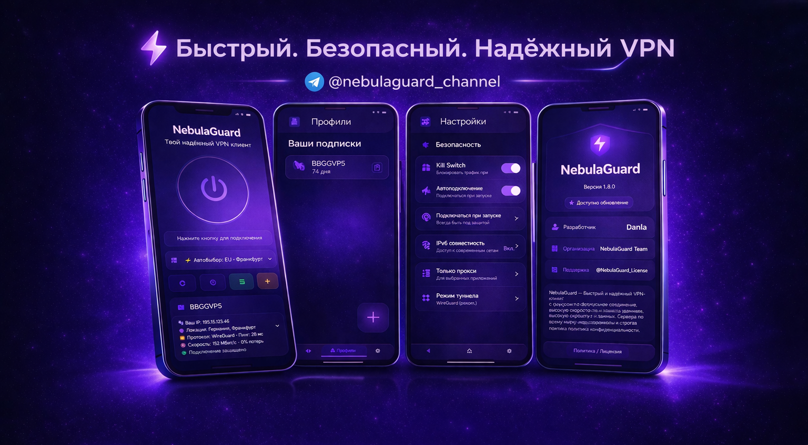

# 🚀 NebulaGuard  
> Android VPN-клиент для VLESS / Xray / современных протоколов  

  

---

## ✨ О проекте

**NebulaGuard** — это Android-приложение на **Kotlin**, предоставляющее быстрый, безопасный и стабильный доступ к сети через современные прокси-протоколы.

Приложение построено как удобный и мощный клиент для работы с **VLESS**, **Xray** и другими решениями, ориентированными на приватность и обход ограничений.

> 💡 Минимум лишнего — максимум контроля и скорости.

---

## 📱 UI / UX

- 🌑 Минималистичный тёмный интерфейс  
- 📊 Главный экран подключения (статус, пинг, скорость)  
- ⚡ One-tap подключение  
- 📡 Удобный список серверов  
- 🔄 Импорт конфигов (ссылка / QR / вручную)  
- 🔔 Статус соединения в реальном времени  

---

## 🔥 Возможности

- 🛰️ Поддержка VLESS / VMess / Trojan / Xray-core  
- 🔐 Безопасное туннелирование трафика  
- 🌍 Обход блокировок и DPI  
- ⚡ Высокая скорость и низкая задержка  
- 📶 Отображение пинга и качества соединения  
- 🔄 Импорт и экспорт конфигураций  
- 🧩 Поддержка кастомных настроек  

---

## 🧠 Технологии

- Kotlin  
- Android SDK (VPN Service API)  
- Xray-core интеграция  
- MVVM / Clean Architecture  

---

## 🧩 Архитектура

- Модульная структура  
- Изоляция VPN-ядра  
- Масштабируемость  
- Стабильность соединения  

---

## 🔐 Приватность

- ❌ Нет сбора данных  
- ❌ Нет логов активности  
- ✅ Полный контроль пользователя  

---

## 🤝 Контрибьютинг

fork → create branch → commit → push → pull request

---

## 📜 Лицензия

MIT License  

---

## 🌌 NebulaGuard

> Secure. Fast. Unrestricted.
